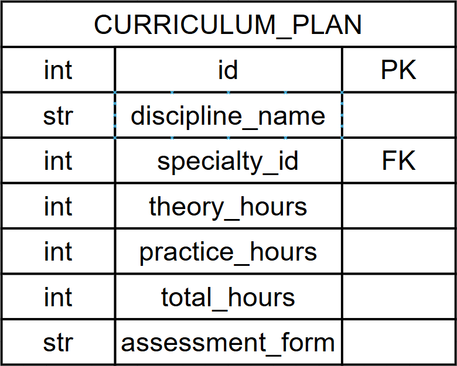

# Вариант №12
# Сервис управления учебными планами (Curriculum Plan Service)

## Сущность: CurriculumPlan (Учебный план)

Главный документ: какие дисциплины, в каком семестре, сколько часов (теория/практика), форма отчетности (экзамен/зачет).

---

### 1. Информация для создания сущности

| Параметр | Обязательность | Тип | Ограничение | Значение по умолчанию |
|----------|----------------|-----|-------------|-----------------------|
| `discipline_name` | Да | str | длина ≤ 200 | — |
| `specialty_id` | Да | int | внешний ключ | — |
| `semester` | Да | int | 1-8 | — |
| `theory_hours` | Да | int | ≥ 0 | — |
| `practice_hours` | Да | int | ≥ 0 | — |
| `total_hours` | Да | int | ≥ 0 | — |
| `assessment_form` | Да | str | 'экзамен', 'зачет', 'курсовая' | — |

**Уникальные комбинации параметров:**
- `discipline_name` + `specialty_id` + `semester`

### 2. Информация, возвращаемая при успешном создании

| Параметр | Тип |
|----------|-----|
| `id` | int |
| `discipline_name` | str |
| `specialty_id` | int |
| `semester` | int |
| `theory_hours` | int |
| `practice_hours` | int |
| `total_hours` | int |
| `assessment_form` | str |

---

## Изменить сущность по ID

### 3. Информация для изменения сущности

| Параметр | Обязательность | Тип | Ограничение | Значение по умолчанию |
|----------|----------------|-----|-------------|-----------------------|
| `discipline_name` | Нет | str | длина ≤ 200 | текущее значение |
| `theory_hours` | Нет | int | ≥ 0 | текущее значение |
| `practice_hours` | Нет | int | ≥ 0 | текущее значение |
| `total_hours` | Нет | int | ≥ 0 | текущее значение |
| `assessment_form` | Нет | str | 'экзамен', 'зачет', 'курсовая' | текущее значение |

### 4. Информация, возвращаемая при успешном изменении

| Параметр | Тип |
|----------|-----|
| `id` | int |
| `discipline_name` | str |
| `specialty_id` | int |
| `semester` | int |
| `theory_hours` | int |
| `practice_hours` | int |
| `total_hours` | int |
| `assessment_form` | str |

---

## Удалить сущность по ID

Вернет `True` (удалено) или `False` (не найдено) в поле `deleted`.

---

## Получить сущность по ID

### 5. Информация, возвращаемая при успешном поиске

| Параметр | Тип |
|----------|-----|
| `id` | int |
| `discipline_name` | str |
| `specialty_id` | int |
| `semester` | int |
| `theory_hours` | int |
| `practice_hours` | int |
| `total_hours` | int |
| `assessment_form` | str |

---

## Получить список сущностей по заданным параметрам

### 6. Параметры для получения списка

| Параметр | Тип | Описание |
|----------|-----|-----------|
| `specialty_id` | int | Фильтр по ID специальности |
| `semester` | int | Фильтр по семестру |
| `assessment_form` | str | Фильтр по форме отчетности |
| `limit` | int | Максимум записей (по умолчанию 100) |

### 7. Возвращаемый список сущностей

| Параметр | Тип |
|----------|-----|
| `id` | int |
| `discipline_name` | str |
| `specialty_id` | int |
| `semester` | int |
| `theory_hours` | int |
| `practice_hours` | int |
| `total_hours` | int |
| `assessment_form` | str |

