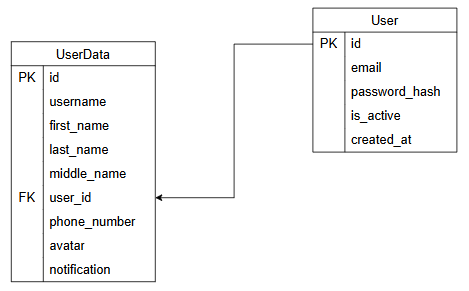

# Вариант №2. Сервис профилей (Profile Service):

## Создание профиля

### Информация требуемая для создания профиля пользователя

|Параметр|Обязательность|Тип|Ограничение|Значение по умолчанию|
|----------|----------------|-----|-------------|----------------------|
|first_name|Не обязательно|Строка|—|None|
|last_name|Не обязательно|Строка|—|None|
|middle_name|Не обязательно|Строка|—|None|
|user_id|Обязательно|Целое число|Уникальный, внешний ключ|—|
|email|Обязательно|Строка|Уникальный, формат почты|—|
|phone_number|Не обязательно|Строка|Уникальный, формат телефона|None|
|avatar|Не обязательно|Строка|формат URL|None|
|notification|Не обязательно|Логический|—|True|
|is_active|Не обязательно|Логический|—|True|

### Выходные данные

|Параметр|Тип|
|----------|-----|
|id|Целое число|
|first_name|Строка|
|last_name|Строка|
|middle_name|Строка|
|user_id|Целое число|
|email|Строка|
|phone_number|Строка|
|avatar|Строка|
|notification|Логический|
|is_active|Логический|

## Изменить профиль по ID

### Информация требуемая для изменения профиля по ID

|Параметр|Обязательность|Тип|Ограничение|Значение по умолчанию|
|----------|----------------|-----|-------------|----------------------|
|first_name|Не обязательно|Строка|—|—|
|last_name|Не обязательно|Строка|—|—|
|middle_name|Не обязательно|Строка|—|—|
|user_id|Не обязательно|Целое число|Уникальный, внешний ключ|—|
|email|Не обязательно|Строка|Уникальный, формат почты|—|
|phone_number|Не обязательно|Строка|Уникальный, формат телефона|—|
|avatar|Не обязательно|Строка|формат URL|—|
|notification|Не обязательно|Логический|—|—|
|is_active|Не обязательно|Логический|—|—|

### Выходные данные

|Параметр|Тип|
|----------|-----|
|id|Целое число|
|first_name|Строка|
|last_name|Строка|
|middle_name|Строка|
|user_id|Целое число|
|email|Строка|
|phone_number|Строка|
|avatar|Строка|
|notification|Логический|
|is_active|Логический|

## Удаление профиля по ID

Установит значение False в поле is_active в записи из таблицы UserData и в связанной записи таблицы User, а потом вернет True, если профиль был успешно переведен в неактивное состояние, иначе вернет False

## Получить профиль по ID

### Выходные данные

|Параметр|Тип|
|----------|-----|
|id|Целое число|
|first_name|Строка|
|last_name|Строка|
|middle_name|Строка|
|user_id|Целое число|
|email|Строка|
|phone_number|Строка|
|avatar|Строка|
|notification|Логический|
|is_active|Логический|

## Получить список профилей по заданным параметрам

### Информация требуемая для получения списка профилей

|Параметр|Тип|Описание|
|----------|-----|----------|
|first_name|Строка|Фильтр по имени|
|last_name|Строка|Фильтр по фамилии|
|middle_name|Строка|Фильтр по отчеству|
|email|Строка|Фильтр по почте|
|phone_number|Строка|Фильтр по телефону|
|is_active|Логический|Фильтр по статусу|

### Информация возвращается в виде списка профилей

|Параметр|Тип|
|----------|-----|
|id|Целое число|
|first_name|Строка|
|last_name|Строка|
|middle_name|Строка|
|user_id|Целое число|
|email|Строка|
|phone_number|Строка|
|avatar|Строка|
|notification|Логический|
|is_active|Логический|

## ER-диаграмма
