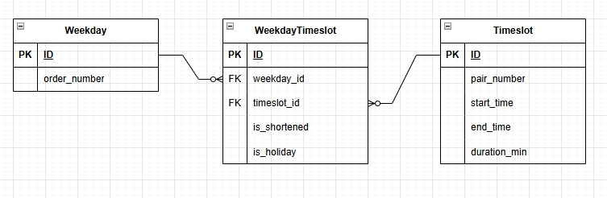

## Вариант №22. Timeslot Service (Сервис временных слотов)

**Сущность Timeslot (Временной слот)**

**Добавить Timeslot**

**Информация требуемая для создания Timeslot**

| Параметр | Пояснение | Обязательность | Тип | Ограничение | Значение по умолчанию |
| -------- | --------- | -------------- | --- | ----------- | --------------------- |
| pair_number | Номер пары | Обязательно | integer | от 1 до 7 | - |
| start_time | Время начала пары | Обязательно | time | формат HH:MM:SS | - |
| end_time | Время окончания пары | Обязательно | time | формат HH:MM:SS, больше start_time | - |

**Информация возвращаемая при успешном создании Timeslot**

| Параметр | Тип |
| -------- | --- |
| id | integer |
| pair_number | integer |
| start_time | time |
| end_time | time |

**Изменить Timeslot по ID**

**Информация требуемая для изменения Timeslot**

| Параметр | Пояснение | Обязательность | Тип | Ограничение | Значение по умолчанию |
| -------- | --------- | -------------- | --- | ----------- | --------------------- |
| pair_number | Номер пары | Не обязательно | integer | от 1 до 7 | - |
| start_time | Время начала пары | Не обязательно | time | формат HH:MM:SS | - |
| end_time | Время окончания пары | Не обязательно | time | формат HH:MM:SS, больше start_time | - |

**Информация возвращаемая при успешном изменении Timeslot**

| Параметр | Тип |
| -------- | --- |
| id | integer |
| pair_number | integer |
| start_time | time |
| end_time | time |

**Удалить Timeslot по ID**

Вернет `True`, если временной слот был удален, иначе вернет `False`

**Получить Timeslot по ID**

**Информация возвращаемая при успешном поиске Timeslot**

| Параметр | Пояснение | Тип |
| -------- | --------- | --- |
| id | Уникальный идентификатор временного слота | integer |
| pair_number | Номер пары | integer |
| start_time | Время начала пары | time |
| end_time | Время окончания пары | time |

**Получить список Timeslot по заданным параметрам**

**Информация требуемая для получения списка временных слотов**

| Параметр | Пояснение | Тип | Описание |
| -------- | --------- | --- | -------- |
| pair_number | Номер пары | integer | Равно указанному значению |
| start_time | Время начала пары | time | Равно указанному времени |
| end_time | Время окончания пары | time | Равно указанному времени |

**Информация возвращаемая в виде списка Timeslot**

| Параметр | Тип |
| -------- | --- |
| id | integer |
| pair_number | integer |
| start_time | time |
| end_time | time |

---

**Сущность WeekdayTimeslot**

**Добавить WeekdayTimeslot**

**Информация требуемая для создания WeekdayTimeslot**

| Параметр | Пояснение | Обязательность | Тип | Ограничение | Значение по умолчанию |
| -------- | --------- | -------------- | --- | ----------- | --------------------- |
| timeslot_id | ID временного слота | Обязательно | integer | внешний ключ к timeslot.id | - |
| is_shortened | Является ли пара сокращенной | Обязательно | boolean | 0 или 1 | 0 |
| is_holiday | Является ли день праздничным | Обязательно | boolean | 0 или 1 | 0 |

**Информация возвращаемая при успешном создании WeekdayTimeslot**

| Параметр | Тип |
| -------- | --- |
| id | integer |
| timeslot_id | integer |
| is_shortened | boolean |
| is_holiday | boolean |

**Изменить WeekdayTimeslot по ID**

**Информация требуемая для изменения связи**

| Параметр | Пояснение | Обязательность | Тип | Ограничение | Значение по умолчанию |
| -------- | --------- | -------------- | --- | ----------- | --------------------- |
| timeslot_id | ID временного слота | Не обязательно | integer | внешний ключ к timeslot.id | - |
| is_shortened | Является ли пара сокращенной | Не обязательно | boolean | 0 или 1 | - |
| is_holiday | Является ли день праздничным | Не обязательно | boolean | 0 или 1 | - |

**Информация возвращаемая при успешном изменении WeekdayTimeslot**

| Параметр | Тип |
| -------- | --- |
| id | integer |
| timeslot_id | integer |
| is_shortened | boolean |
| is_holiday | boolean |

**Удалить WeekdayTimeslot по ID**

Вернет `True`, если связь была удалена, иначе вернет `False`

**Получить WeekdayTimeslot по ID**

**Информация возвращаемая при успешном поиске WeekdayTimeslot**

| Параметр | Пояснение | Тип |
| -------- | --------- | --- |
| id | Уникальный идентификатор связи | integer |
| timeslot_id | ID временного слота | integer |
| is_shortened | Является ли пара сокращенной | boolean |
| is_holiday | Является ли день праздничным | boolean |

**Получить список WeekdayTimeslot по заданным параметрам**

**Информация требуемая для получения WeekdayTimeslot**

| Параметр | Пояснение | Тип | Описание |
| -------- | --------- | --- | -------- |
| timeslot_id | ID временного слота | integer | Равно указанному значению |
| is_shortened | Сокращенная ли пара | boolean | 0 или 1 |
| is_holiday | Праздничный ли день | boolean | 0 или 1 |
| pair_number | Номер пары | integer | Равно указанному значению |

**Информация возвращаемая в виде WeekdayTimeslot**

| Параметр | Тип |
| -------- | --- |
| id | integer |
| timeslot_id | integer |
| pair_number | integer |
| start_time | time |
| end_time | time |
| duration_min | integer |
| is_shortened | boolean |
| is_holiday | boolean |

**ERD-диаграмма**

