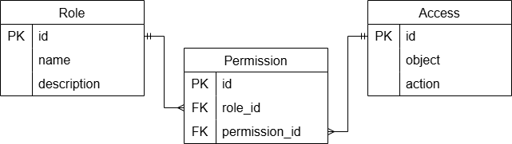

## Создать Role (create)

|Параметр|Пояснение|Обязательность|Тип|Ограничение|Значение по умолчанию|
|----|----|----|----|----|----|
|name|название роли|да|str|уникальное, min length 1, max length 255|-|
|description|описание роли|нет|str|max length 255|None|

#### Информация после удачного создания роли

|Параметр|Тип|
|----|----|
|id|int|
|name|str|
|description|str/None|

## Изменить Role по ID (change)

|Параметр|Пояснение|Обязательность|Тип|Ограничение|Значение по умолчанию|
|----|----|----|----|----|----|
|id|id изменяемой роли|да|int|-|-|
|name|новое название роли|нет|str|уникальное, min length 1, max length 255|-|
|description|новое описание роли|нет|str|max length 255|-|

#### Информация после удачного создания роли

|Параметр|Тип|
|----|----|
|id|int|
|name|str|
|description|str/None|

## Удалить Role по ID (delete)
Вернет True, если Role была закрыта (удалена), иначе вернет False

## Получить Role по ID (get)
#### Информация после удачного поиска 

|Параметр|Пояснение|Тип|
|----|----|----|
|id|id роли|int|
|name|название роли|str|
|description|описание роли|str|

## Получить Role по заданным параметрам (get list)

|Параметр|Пояснение|Тип|Описание|
|----|----|----|----|
|name_filter|Частичное совпадение имени|str|LIKE %|
|limit|лимит количества записей|int|по умолчанию все подходящие|

#### Информация после удачного поиска 

|Параметр|Пояснение|Тип|
|----|----|----|
|id|id роли|int|
|name|название роли|str|
|description|описание роли|str|

## ER-диаграмма

