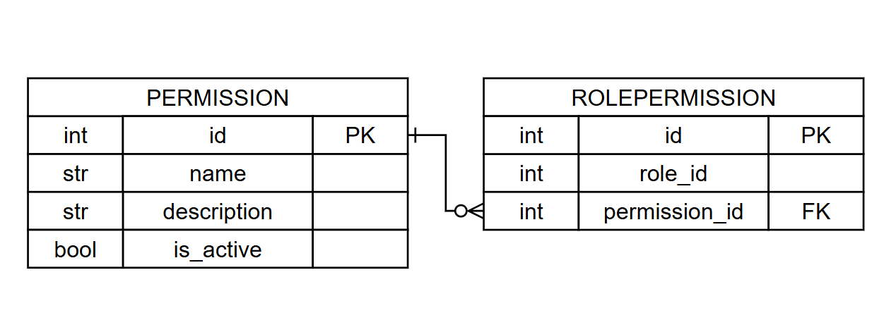

# Вариант №4
# Сервис управления разрешениями (Permission Service)

## Сущность: Permission (Разрешение)

Тонкая настройка прав: кто может редактировать расписание, кто только смотреть, кто может назначать замены.

---

### 1. Информация для создания сущности

`POST /permissions`

| Параметр | Пояснение | Обязательность | Тип | Ограничение | Значение по умолчанию |
|----------|-----------|----------------|-----|-------------|-----------------------|
| `name` | Название разрешения | Да | str | длина ≤ 100, уникально | — |
| `description` | Описание разрешения | Нет | str | длина ≤ 255 | `''` |

**Уникальные комбинации параметров:**
- `name` — должно быть уникальным

### 2. Информация, возвращаемая при успешном создании

| Параметр | Тип |
|----------|-----|
| `id` | int |
| `name` | str |
| `description` | str |
| `is_active` | bool |

---

## Изменить сущность по ID

### 3. Информация для изменения

`PUT /permissions/{id}`

| Параметр | Пояснение | Обязательность | Тип | Ограничение | Значение по умолчанию |
|----------|-----------|----------------|-----|-------------|-----------------------|
| `name` | Новое название | Нет | str | длина ≤ 100, уникально | текущее значение |
| `description` | Новое описание | Нет | str | длина ≤ 255 | текущее значение |

> Поле `is_active` не может быть изменено через данный эндпоинт. Для изменения активности используется soft delete.

### 4. Информация, возвращаемая при успешном изменении

| Параметр | Тип |
|----------|-----|
| `id` | int |
| `name` | str |
| `description` | str |
| `is_active` | bool |

---

## Удалить сущность по ID (soft delete)

`DELETE /permissions/{id}`

> **Важно:** Фактически запись из БД не удаляется, а помечается как неактивная через булевое поле `is_active = false`. При успешном удалении возвращается обновлённый объект разрешения.

### Информация, возвращаемая при удалении

| Параметр | Тип |
|----------|-----|
| `id` | int |
| `name` | str |
| `description` | str |
| `is_active` | bool |

---

## Получить сущность по ID

`GET /permissions/{id}`

| Параметр | Пояснение | Тип |
|----------|-----------|-----|
| `id` | Уникальный идентификатор | int |
| `name` | Название разрешения | str |
| `description` | Описание | str |
| `is_active` | Активность разрешения | bool |

---

## Получить список сущностей по заданным параметрам

`GET /permissions`

### Параметры для получения списка

| Параметр | Пояснение | Тип | Описание |
|----------|-----------|-----|----------|
| `name` | Фильтр по названию | str | Частичное совпадение |
| `is_active` | Фильтр по активности | bool | true/false |
| `limit` | Лимит записей | int | Максимум записей (по умолчанию 100) |
| `offset` | Смещение | int | Смещение для пагинации (по умолчанию 0) |

### Возвращаемый список сущностей

| Параметр | Тип |
|----------|-----|
| `id` | int |
| `name` | str |
| `description` | str |
| `is_active` | bool |

---

## Сущность: RolePermission (Связь роли и разрешения)

Служебная транзитивная таблица для реализации связи **многие ко многим** между ролями (Role Service) и разрешениями (Permission Service).

### 1. Информация для создания связи

`POST /role-permissions`

| Параметр | Пояснение | Обязательность | Тип | Ограничение | Значение по умолчанию |
|----------|-----------|----------------|-----|-------------|-----------------------|
| `role_id` | ID роли (из Role Service) | Да | int | — | — |
| `permission_id` | ID разрешения | Да | int | — | — |

**Уникальные комбинации параметров:**
- `role_id` + `permission_id` — пара должна быть уникальной

### 2. Информация, возвращаемая при успешном создании

| Параметр | Тип |
|----------|-----|
| `id` | int |
| `role_id` | int |
| `permission_id` | int |

---

## Удалить связь роли и разрешения

`DELETE /role-permissions`

### Параметры для удаления

| Параметр | Пояснение | Обязательность | Тип |
|----------|-----------|----------------|-----|
| `role_id` | ID роли | Да | int |
| `permission_id` | ID разрешения | Да | int |

### Информация, возвращаемая при удалении

| Параметр | Тип |
|----------|-----|
| `deleted` | bool |

> Вернет `True`, если связь была удалена, иначе `False`

---

## Получить разрешения по ID роли

`GET /role-permissions/{role_id}`

### Возвращаемый список разрешений для роли

| Параметр | Тип |
|----------|-----|
| `id` | int |
| `name` | str |
| `description` | str |
| `is_active` | bool |

---

## Точки входа REST API

| Метод | Эндпоинт | Описание |
|-------|----------|----------|
| POST | `/permissions` | Создать разрешение |
| GET | `/permissions/{id}` | Получить разрешение по ID |
| GET | `/permissions` | Получить список разрешений с фильтрацией |
| PUT | `/permissions/{id}` | Обновить разрешение |
| DELETE | `/permissions/{id}` | Удалить разрешение (soft delete) |
| POST | `/role-permissions` | Назначить разрешение роли |
| DELETE | `/role-permissions` | Отозвать разрешение у роли |
| GET | `/role-permissions/{role_id}` | Получить все разрешения для роли |

---

## ER-диаграмма

ER-диаграмма представлена в файле `erd.png`:

