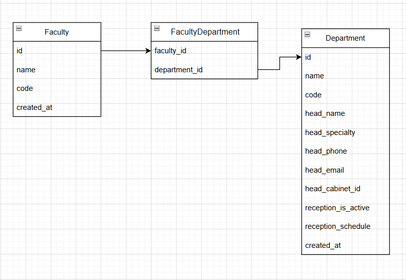

# Faculty Service - Справочник отделений СПО

## ER-диаграмма

## Сущность: Department (Отделение)

### 1. Информация для создания сущности

| Параметр | Обязательность | Тип | Ограничение | Значение по умолчанию |
|----------|----------------|-----|-------------|-----------------------|
| name | Да | string | 2-200 символов, уникально | — |
| code | Да | string | 2-20 символов, уникально | — |
| head_name | Да | string | 2-150 символов | — |
| head_specialty | Нет | string | 2-200 символов | null |
| head_phone | Нет | string | формат +7XXXXXXXXXX | null |
| head_email | Нет | string | формат email | null |
| head_cabinet_id | Нет | integer | положительное число | null |
| reception_is_active | Нет | boolean | true/false | false |
| reception_schedule | Нет | string | до 500 символов | null |

**Уникальные комбинации параметров:** name и code

### 2. Информация, возвращаемая при успешном создании

| Параметр | Тип | Что хранится |
|----------|-----|----------------|
| id | integer | Уникальный номер отделения |
| name | string | Название отделения |
| code | string | Шифр направления подготовки |
| head_name | string | ФИО заведующего отделением |
| head_specialty | string или null | Специальность заведующего |
| head_phone | string или null | Телефон заведующего |
| head_email | string или null | Email заведующего |
| head_cabinet_id | integer или null | Номер кабинета заведующего |
| reception_is_active | boolean | Активен ли приём (да/нет) |
| reception_schedule | string или null | Время приёма заведующего |
| created_at | datetime | Дата и время создания записи |

## Изменить сущность по ID

### 3. Информация для изменения сущности

| Параметр | Обязательность | Тип | Ограничение | Значение по умолчанию |
|----------|----------------|-----|-------------|-----------------------|
| name | Нет | string | 2-200 символов, уникально | текущее значение |
| code | Нет | string | 2-20 символов, уникально | текущее значение |
| head_name | Нет | string | 2-150 символов | текущее значение |
| head_specialty | Нет | string | 2-200 символов | текущее значение |
| head_phone | Нет | string | формат +7XXXXXXXXXX | текущее значение |
| head_email | Нет | string | формат email | текущее значение |
| head_cabinet_id | Нет | integer | положительное число | текущее значение |
| reception_is_active | Нет | boolean | true/false | текущее значение |
| reception_schedule | Нет | string | до 500 символов | текущее значение |

### 4. Информация, возвращаемая при успешном изменении

| Параметр | Тип | Что хранится |
|----------|-----|----------------|
| id | integer | Уникальный номер отделения |
| name | string | Название отделения |
| code | string | Шифр направления подготовки |
| head_name | string | ФИО заведующего отделением |
| head_specialty | string или null | Специальность заведующего |
| head_phone | string или null | Телефон заведующего |
| head_email | string или null | Email заведующего |
| head_cabinet_id | integer или null | Номер кабинета заведующего |
| reception_is_active | boolean | Активен ли приём (да/нет) |
| reception_schedule | string или null | Время приёма заведующего |
| created_at | datetime | Дата и время создания записи |

## Удалить сущность по ID

Вернет `True`, если отделение было удалено, иначе `False`

## Получить сущность по ID

### 5. Информация, возвращаемая при успешном поиске

| Параметр | Тип | Что хранится |
|----------|-----|----------------|
| id | integer | Уникальный номер отделения |
| name | string | Название отделения |
| code | string | Шифр направления подготовки |
| head_name | string | ФИО заведующего отделением |
| head_specialty | string или null | Специальность заведующего |
| head_phone | string или null | Телефон заведующего |
| head_email | string или null | Email заведующего |
| head_cabinet_id | integer или null | Номер кабинета заведующего |
| reception_is_active | boolean | Активен ли приём (да/нет) |
| reception_schedule | string или null | Время приёма заведующего |
| created_at | datetime | Дата и время создания записи |

## Получить список сущностей по заданным параметрам

### 6. Параметры для получения списка

| Параметр | Тип | Описание |
|----------|-----|-------------|
| page | integer | Номер страницы (по умолчанию 1) |
| size | integer | Количество записей на странице (по умолчанию 10) |
| name | string | Поиск по части названия отделения |

### 7. Возвращаемый список сущностей

| Параметр | Тип | Что хранится |
|----------|-----|----------------|
| id | integer | Уникальный номер отделения |
| name | string | Название отделения |
| code | string | Шифр направления подготовки |
| head_name | string | ФИО заведующего отделением |
| head_specialty | string или null | Специальность заведующего |
| head_phone | string или null | Телефон заведующего |
| head_email | string или null | Email заведующего |
| head_cabinet_id | integer или null | Номер кабинета заведующего |
| reception_is_active | boolean | Активен ли приём (да/нет) |
| reception_schedule | string или null | Время приёма заведующего |
| created_at | datetime | Дата и время создания записи |
