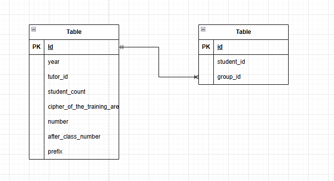

# **Вариант №7. Сервис групп(Group Service)**
### Функции сервиса
#### Добавить группу.

|Параметр| Пояснение | Обязательность | Тип | Ограничение | Значение по умолчанию |
|---|---|---|---|---|---|
|year| Год поступления | Обязательно | Целое число | от 2000 до 2999 | — |
|ruk_id| id руководителя | Не обязательно | Целое число | строго больше 0 | `NULL` |
|stud_count| Количество студентов | Не обязательно | Целое число | от 0 до 30 | 0|
|code_np| Шифр направления подготовки | Обязательно | Строка | вида `NN.NN.NN` (цифры, разделённые точками) | — |
|number| Номер группы | Обязательно | Целое число | строго больше 0 | — |
|after_class_number| После какого класса поступили | Обязательно | Целое число | строго 9 или 11 | — |
|prefix| Префикс | Обязательно | Строка | длина строки от 0 до 2 | — |

##### Информация возвращаемая в случае удачного запроса.

|Параметр|Пояснение|Тип|
|---|---|---|
|year|Год поступления|Целое чисто|
|ruk_id|id руководителя|Целое число|
|stud_count|Количество студентов|Целое число|
|code_np|Шифр направления подготовки|Строка|
|number|Номер группы|Целое число|
|after_class_number|После какого класса поступили|Целое число|
|prefix|Префикс|Строка|

#### Изменить группу по ID.

|Данные которые можно изменить|Обязательность|Тип|Ограничение|Значение по умолчанию|
|---|---|---|---|---|
|ruk_id|Необязательный|Целое число|Строго больше 0|`NULL`|
|stud_count|Необязательный|Целое число|0 до 30|0|

##### Информация возвращаемая в случае удачного запроса.

|Параметр|Пояснение|Тип|
|---|---|---|
|year|Год поступления|Целое чисто|
|ruk_id|id руководителя|Целое число|
|stud_count|Количество студентов|Целое число|
|code_np|Шифр направления подготовки|Строка|
|number|Номер группы|Целое число|
|after_class_number|После какого класса поступили|Целое число|
|prefix|Префикс|Строка|

#### Удаление группы по ID.

|Удаление|
|---|
|Подрозумевает под собой изменение статуса активности группы на неактивную|

##### Информация возвращаемая в случае удачного запроса.

|Параметр|Пояснение|Тип|
|---|---|---|
|year|Год поступления|Целое чисто|
|ruk_id|id руководителя|Целое число|
|is_active|Статус активности группы|Булевый тип `False`|
|stud_count|Количество студентов|Целое число|
|code_np|Шифр направления подготовки|Строка|
|number|Номер группы|Целое число|
|after_class_number|После какого класса поступили|Целое число|
|prefix|Префикс|Строка|

#### Получить группу по ID.

##### Информация возвращаемая в случае удачного запроса.

|Параметр|Пояснение|Тип|
|---|---|---|
|year|Год поступления|Целое число|
|ruk_id|id_руководителя|Целое число|
|stud_count|количество студентов|Целое число|
|code_np|шифр направления подготовки|Строка|
|number|номер группы|Целое число|
|after_class_number|После какого класса поступили|Целое число|
|prefix|Префикс|Строка|

#### Получение списка активных групп по параметрам.

| Параметр | Тип | Условия фильтрации |
|---|---|---|
| Год поступления| целое число | меньше указанного, равно указанному, больше указанного |
| id руководителя| целое число | равно указанному |
| Количество студентов| целое число | меньше указанного, равно указанному, больше указанного |
| Шифр направления подготовки| строка | равно указанному |
| Номер группы| целое число | равно указанному |
| После какого класса поступили| целое число | равно указанному |

##### Информация возвращаемая в случае удачного запроса.

|Параметр|Пояснение|Тип|
|---|---|---|
|year|Год поступления|Целое число|
|ruk_id|id_руководителя|Целое число|
|stud_count|количество студентов|Целое число|
|code_np|шифр направления подготовки|Строка|
|number|номер группы|Целое число|
|after_class_number|После какого класса поступили|Целое число|
|prefix|Префикс|Строка|

ER-диаграмма (Entity-Relationship Diagram)

