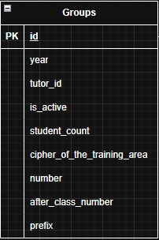

# **Вариант №7. Сервис групп (Group Service)**

## Функции сервиса

### Добавить группу.

| Параметр | Пояснение | Обязательность | Тип | Ограничение | Значение по умолчанию |
|---|---|---|---|---|---|
| year | Год поступления | Обязательно | Целое число | 2000 ≤значение≤ 2999 | — |
| tutor_id | ID руководителя | Не обязательно | Целое число | значение > 0 | `None` |
| student_count | Количество студентов | Не обязательно | Целое число | 0 ≤значение≤ 30 | 0 |
| cipher_of_the_training_area | Шифр направления подготовки | Обязательно | Строка | вида `NN.NN.NN` (цифры, разделённые точками) | — |
| number | Номер группы | Обязательно | Целое число | > 0 | — |
| after_class_number | После какого класса поступили | Обязательно | Целое число | значение = 9 или 11 | — |
| prefix | Префикс | Обязательно | Строка | 1 ≤длинна строки≤ 2 | — |

#### Информация, возвращаемая в случае удачного запроса

| Параметр | Пояснение | Тип |
|---|---|---|
| id | ID группы | Целое число |
| year | Год поступления | Целое число |
| is_active | Статус активности группы | Булевый |
| tutor_id | ID руководителя | Целое число |
| student_count | Количество студентов | Целое число |
| cipher_of_the_training_area | Шифр направления подготовки | Строка |
| number | Номер группы | Целое число |
| after_class_number | После какого класса поступили | Целое число |
| prefix | Префикс | Строка |

---

### Изменить группу по ID

| Параметр | Пояснение | Обязательность | Тип | Ограничение | 
| id | ID группы | Обязательно | Целое число | значение > 0 |
| tutor_id | ID руководителя | Не обязательно | Целое число | значение > 0 | 
| student_count | Количество студентов | Не обязательно | Целое число | 0 ≤значение≤ 30 |

#### Информация, возвращаемая в случае удачного запроса

| Параметр | Пояснение | Тип |
|---|---|---|
| id | ID группы | Целое число |
| year | Год поступления | Целое число |
| is_active | Статус активности группы | Булевый |
| tutor_id | ID руководителя | Целое число |
| student_count | Количество студентов | Целое число |
| cipher_of_the_training_area | Шифр направления подготовки | Строка |
| number | Номер группы | Целое число |
| after_class_number | После какого класса поступили | Целое число |
| prefix | Префикс | Строка |

---

### Удаление группы по ID

| Параметр | Пояснение | Обязательность | Тип | Ограничение | 
|---|---|---|---|---|
| id | ID группы | Обязательно | Целое число | значение > 0 |

> Фактически запись из БД не удаляется, а помечается как неактивная (через булевое поле `is_active`).

#### Информация, возвращаемая в случае удачного запроса

|Параметр|Тип|
|---|---|
|deleted|Булевый|

---

### Получить группу по ID

| Параметр | Пояснение | Тип | 
|---|---|---|
| id | ID группы | Целое число |

#### Информация, возвращаемая в случае удачного запроса

| Параметр | Пояснение | Тип |
|---|---|---|
| id | ID группы | Целое число |
| year | Год поступления | Целое число |
| tutor_id | ID руководителя | Целое число |
| is_active | Статус активности группы | Булевый |
| student_count | Количество студентов | Целое число |
| cipher_of_the_training_area | Шифр направления подготовки | Строка |
| number | Номер группы | Целое число |
| after_class_number | После какого класса поступили | Целое число |
| prefix | Префикс | Строка |

---

### Получить группы по заданным параметрам

| Параметр | Пояснение | Тип | 
|---|---|---|
| year | Год поступления| Целое число; фильтрация: <, =, > |
| tutor_id | ID руководителя| Целое число; фильтрация: = | 
| is_active | Статус активности группы | Булевый; фильтрация (`True` или `False`) |
| student_count | Количество студентов| Целое число; фильтрация: <, =, > |
| cipher_of_the_training_area | Шифр направления подготовки | Строка; фильтрация: = |
| number | Номер группы | Целое число;фильтрация: =  | 
| after_class_number | После какого класса поступили | Целое число; фильтрация: равное 9 или 11 |

#### Параметры фильтрации GET /groups
>- `year_filter` - тип сравнения для года (eq/lt/gt)
>- `student_count_filter` - тип сравнения для количества студентов (eq/lt/gt)

#### Информация, возвращаемая в случае удачного запроса

| Параметр | Пояснение | Тип |
|---|---|---|
| id | ID группы | Целое число |
| year | Год поступления | Целое число |
| tutor_id | ID руководителя | Целое число |
| is_active | Статус активности группы | Булевый |
| student_count | Количество студентов | Целое число |
| cipher_of_the_training_area | Шифр направления подготовки | Строка |
| number | Номер группы | Целое число |
| after_class_number | После какого класса поступили | Целое число |
| prefix | Префикс | Строка |

---

## Уникальные комбинации параметров

>Должна быть проверка на уникальность при создании группы(проверка только среди активных групп.)
>Нельзя создать новую группу которой параметры number, after_class_number, prefix совпадают(проверка только среди активных групп.)

## ER-диаграмма

